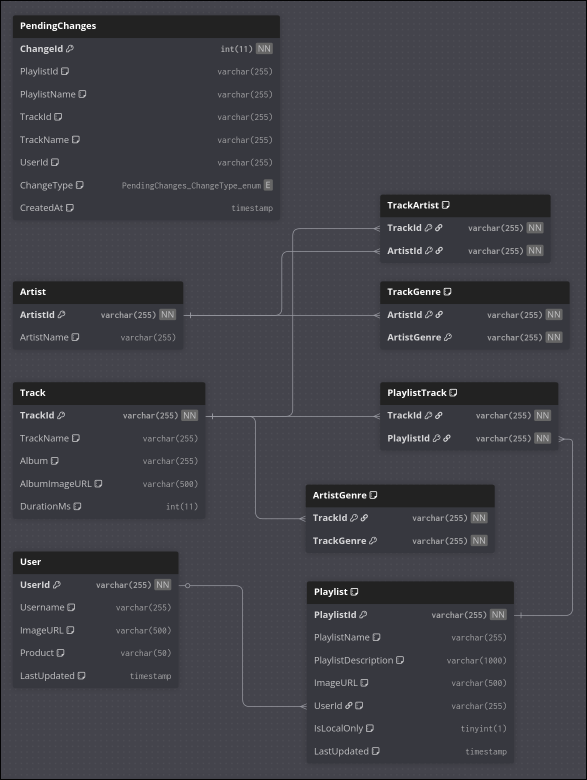

# Report

## Application Description

Sortify is a Spotify playlist management app that makes it easier for users to sort
their playlists. It includes a third party genre tagging system so that users
can more accurately tag the genres of individual songs.

## Methodology

- We make requests to the Spotify API for user, track, and playlist data.
- We then store that data in our database so that we can leverage
relational queries to easier sort the user's playlists for them.

### Database

- MariaDB (drop in replacement for MYSQL)

#### Entity Relationship Diagram

#### DDL

[DB Dump](./app_schema.sql)

[Setup.js](./setup.js)

#### DML

[DB Operations Folder](./db)

## Process

We created an express app connected to a MariaDB database.

## Challenges

- Time - One of the challenges that we faced was time management
both due to differences in how we managed our time as well as time restrictions due to work being done in other classes.
- Teamwork - Differences in working style caused conflicts occasionally such as frustrations with work not being done on time.
- Git - Working as a team means we used git, improper use of git caused occasional git conflicts which caused some really minor setbacks at times, these were all resolved but caused some issues down the road.

## Limitations

- Since our app only displays from the database it is at many times out of sync with the actual data that spotify has, meaning that users have to frequently use the "refresh from spotify" button. Also since we only make API calls when the refresh button is pressed it makes the API calls slower since everything is done at one time instead of API calls being made as they're needed. This means that you're often staring at the loading screen especially for larger playlists.

## Future Work

- Ability to tag artists with specific genres (not just tracks)
- Ability to use Shift + Click and CTRL + Click to select multiple items at once.
- Fix genres being stored incorrectly currently they are being stored as a list as opposed to being stored atomically.
- User specific genre/artist information (user statistics are currently just the global statistics of all songs in the DB)

## Conclusion

- It works and does most of what I want it to do - Caleb
